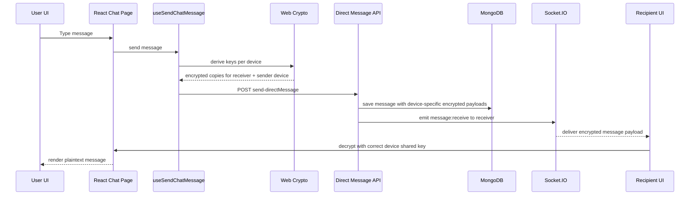

# Discord Life / Discord Clone — Complete Project Documentation

## 1. Project Overview

This repository is a Discord-inspired real-time messaging application built with the MERN stack, Socket.IO, Redux, and end-to-end encryption (E2EE). The application combines private direct-message chat, online presence tracking, authentication, friend operations, background customization, and multi-device crypto handling.

The codebase is organized into two major parts:

- Frontend: React + Vite + Redux + TanStack Query + Socket.IO client
- Backend: Node.js + Express + MongoDB + Mongoose + Socket.IO server

The project intentionally protects chat content by encrypting message payloads on the client before transmission. The server is designed to relay encrypted data, not to read plaintext.

---

## 2. Core Product Goals

- Real-time one-to-one messaging
- Discord-style friend and presence experience
- Multi-device authentication and session support
- Client-side encrypted message payloads
- Device-aware public key distribution
- Robust REST + Socket.IO integration
- Profile and background customization
- Secure cookie-based auth with refresh-token rotation

---

## 3. Technology Stack

### Frontend

- React 19
- Vite
- React Router
- Redux Toolkit
- TanStack Query
- Socket.IO Client
- Framer Motion (used in UI flow)
- Browser Web Crypto API for encryption primitives

### Backend

- Node.js
- Express 5
- MongoDB + Mongoose
- JWT + HTTP-only cookies
- Socket.IO
- Multer + ImageKit
- Cookie parser, CORS, Morgan

---

## 4. Repository Structure

```text
productiveDassboard-
├── README.md
├── TODO.md
├── DISCORD_LIFE_COMPLETE_DOCUMENTATION.md
├── frontend/
│   ├── package.json
│   ├── vite.config.js
│   ├── index.html
│   ├── src/
│   │   ├── App.jsx
│   │   ├── app.routes.jsx
│   │   ├── main.jsx
│   │   ├── api/
│   │   ├── assets/
│   │   ├── components/
│   │   ├── context/
│   │   ├── crypto/
│   │   ├── hooks/
│   │   ├── pages/
│   │   ├── redux/
│   │   ├── socket.io-client/
│   │   └── utils/
│   └── public/
├── server/
│   ├── package.json
│   ├── server.js
│   └── src/
│       ├── app.js
│       ├── config/
│       ├── controller/
│       ├── lib/
│       ├── middleware/
│       ├── model/
│       ├── router/
│       ├── Socket.IO/
│       └── utils/
└── .env (runtime config, not shown in tree)
```

---

## 5. Authentication and Session Model

### 5.1 Auth Flow

Authentication is built around JWTs and HTTP-only cookies.

Key files:

- [server/src/controller/auth.controller.js](server/src/controller/auth.controller.js)
- [server/src/middleware/auth.middleware.js](server/src/middleware/auth.middleware.js)
- [server/src/lib/jwt.js](server/src/lib/jwt.js)
- [server/src/config/config.js](server/src/config/config.js)

### 5.2 Token Strategy

- Access token is signed with JWT secret and used for protected API calls and Socket.IO auth
- Refresh token is stored in the database in hashed form
- Refresh token rotation occurs during the refresh flow
- Sessions are tracked via the Session model

### 5.3 Login / Register

The auth controller handles:

- register
- login
- logout
- refresh
- username validation
- public key storage
- fetching login devices

The app stores user session records and uses HTTP-only cookies to keep auth state secured against XSS-prone access from JavaScript.

### 5.4 Refresh Endpoint

The refresh route validates the request cookie and verifies the refresh token against the DB hash. If valid, the backend issues a fresh access token and refresh token and updates the stored session metadata.

### 5.5 Session Model

The user session state is persisted in Mongo with a separate session model. This allows device tracking and login-device visibility.

---

## 6. API Surface

### Auth routes

From [server/src/router/auth.route.js](server/src/router/auth.route.js):

- POST /api/v1/auth/register
- POST /api/v1/auth/login
- POST /api/v1/auth/logout
- GET /api/v1/auth/refresh
- GET /api/v1/auth/accesstoken
- GET /api/v1/auth/checkUsername/:username
- POST /api/v1/auth/public-key
- GET /api/v1/auth/public-key/:userId
- GET /api/v1/auth/login-devices

### Direct message routes

From [server/src/router/chat/directMessage.route.js](server/src/router/chat/directMessage.route.js):

- POST /api/v1/chat/directMessage/send-directMessage
- GET /api/v1/chat/directMessage/direct-message/:userId
- GET /api/v1/chat/directMessage/direct-messagechatUsers

### Friend and background routes

- /api/v1/friends
- /api/v1/background

---

## 7. Frontend Architecture

### 7.1 Routing

The app uses React Router in [frontend/src/app.routes.jsx](frontend/src/app.routes.jsx).

Protected journeys:

- Home
- Online list
- All friends
- Add friend
- Pending requests
- DM channel route under /channels/@me/:userId

Public journeys:

- /login
- /register

### 7.2 Redux Store

The root store is configured in [frontend/src/redux/authstor.js](frontend/src/redux/authstor.js).

Slices include:

- authinfoSlice
- chat
- AccountSettings
- ProfilePageSettings
- ProfilePagechangeslice
- Friendlist
- onlineFriendsslice

Important state examples:

- [frontend/src/redux/authSlice.js](frontend/src/redux/authSlice.js)
- [frontend/src/redux/chat/Chatslice.js](frontend/src/redux/chat/Chatslice.js)
- [frontend/src/redux/onlineFriends/onlineFriends.js](frontend/src/redux/onlineFriends/onlineFriends.js)

### 7.3 UI Layout

Primary component structure:

- [frontend/src/components/layout/RootLayout.jsx](frontend/src/components/layout/RootLayout.jsx)
- [frontend/src/components/chat/Sidebar.jsx](frontend/src/components/chat/Sidebar.jsx)
- [frontend/src/components/chat/FriendsList.jsx](frontend/src/components/chat/FriendsList.jsx)
- [frontend/src/components/chat/ActiveNow.jsx](frontend/src/components/chat/ActiveNow.jsx)
- [frontend/src/components/chat/Chat.jsx](frontend/src/components/chat/Chat.jsx)

The chat page shell is centered around:

- [frontend/src/components/chat/Chat-page/Chatpage.jsx](frontend/src/components/chat/Chat-page/Chatpage.jsx)
- [frontend/src/components/chat/Chat-page/hooks](frontend/src/components/chat/Chat-page/hooks)

---

## 8. Real-Time Messaging and Presence

### 8.1 Socket.IO Setup

The server bootstraps Socket.IO in [server/server.js](server/server.js) and wires in auth middleware and chat/presence handlers.

Key socket files:

- [server/src/Socket.IO/index.js](server/src/Socket.IO/index.js)
- [server/src/Socket.IO/socket.js](server/src/Socket.IO/socket.js)
- [server/src/Socket.IO/socketAuth.js](server/src/Socket.IO/socketAuth.js)
- [server/src/Socket.IO/online_offline.js](server/src/Socket.IO/online_offline.js)
- [server/src/Socket.IO/chat/mainsocket.js](server/src/Socket.IO/chat/mainsocket.js)

### 8.2 Presence Tracking

The server tracks users by user ID to socket ID mappings. When a socket connects, the user is registered as online. When disconnected, the connected socket is removed from the map.

This allows the app to determine which friends are online and push live presence updates to the frontend.

### 8.3 Message Broadcast

When a message is saved, the backend emits a `message:receive` event to the receiver’s active sockets:

- `senderId` is included in the event payload
- `message` contains the stored message document

This pattern allows the receiver UI to update immediately without polling.

---

## 9. End-to-End Encryption Architecture

### 9.1 Design Principle

The app does not rely on server-side encryption. Instead, message encryption happens in the browser using the Web Crypto API.

The crypto logic is centralized in:

- [frontend/src/crypto/cryptoUtils.js](frontend/src/crypto/cryptoUtils.js)
- [frontend/src/components/chat/Chat-page/hooks/useChatCrypto.js](frontend/src/components/chat/Chat-page/hooks/useChatCrypto.js)

### 9.2 Key Exchange Model

Each device generates and stores a local key pair. Public keys are uploaded to the backend for other users to fetch.

The backend endpoints for this are:

- POST /api/v1/auth/public-key
- GET /api/v1/auth/public-key/:userId

### 9.3 Shared Secret Derivation

The app derives a shared secret using the user’s private key and the other party’s public key. That shared secret is then used for AES-GCM encryption.

The logic is device-aware and supports multiple devices per user. The message model includes encrypted copies for:

- receiver devices
- sender devices

### 9.4 Message Payload Structure

The direct-message schema stores multi-device encrypted copies instead of a single top-level encrypted value.

The model file is:

- [server/src/model/chat/directMessage.model.js](server/src/model/chat/directMessage.model.js)

Each message copy contains:

- senderDeviceId
- receiverDeviceId (for receiver copies)
- encryptedText
- iv

This is crucial because the app supports:

- sending from one device to another user’s device
- sending to multiple devices on the same user
- preserving correct decryption depending on the current device and sender context

### 9.5 Decryption Flow

On the frontend, the chat page extracts the correct message copy based on:

- current user identity
- active device ID
- sender / receiver mapping

When a message is decrypted, the app first finds the matching shared key, then decrypts the ciphertext using AES-GCM. If decryption fails, the UI renders a graceful fallback message instead of crashing.

---

## 10. Chat Message Lifecycle



### 10.1 Sending a Message

The send flow includes:

1. gather receiver and sender device identities
2. fetch or build shared keys for each relevant device
3. encrypt copies for recipient devices and sender devices
4. submit the payload to the backend
5. persist the encrypted record
6. emit the message to the receiver

### 10.2 Receiving a Message

When a socket `message:receive` event arrives:

- the frontend resolves the relevant shared key
- selects the correct encrypted payload for the active device
- decrypts the data
- updates local chat state without breaking the original app data flow

---

## 11. Multi-Device Security Design

This application is explicitly designed around multi-device encrypted chat. The keys are distributed per device, and each message document contains multiple encrypted copies.

This means:

- a user logged in on desktop and mobile can both read conversations correctly
- each device can only decrypt the copy intended for it
- sender-side copies are kept for other devices owned by the same user
- decryption logic is tied to the exact sender and receiver device IDs

The correct handling of this flow is one of the most important parts of the app’s architecture.

---

## 12. Frontend Chat Hooks and Utilities

The chat page was modularized into a reusable hook-based architecture. Important files include:

- [frontend/src/components/chat/Chat-page/hooks/useChatCrypto.js](frontend/src/components/chat/Chat-page/hooks/useChatCrypto.js)
- [frontend/src/components/chat/Chat-page/hooks/useChatMessages.js](frontend/src/components/chat/Chat-page/hooks/useChatMessages.js)
- [frontend/src/components/chat/Chat-page/hooks/useSendChatMessage.js](frontend/src/components/chat/Chat-page/hooks/useSendChatMessage.js)
- [frontend/src/components/chat/Chat-page/hooks/useChatSocket.js](frontend/src/components/chat/Chat-page/hooks/useChatSocket.js)
- [frontend/src/components/chat/Chat-page/hooks/useChatTyping.js](frontend/src/components/chat/Chat-page/hooks/useChatTyping.js)
- [frontend/src/components/chat/Chat-page/hooks/useChatScroll.js](frontend/src/components/chat/Chat-page/hooks/useChatScroll.js)
- [frontend/src/components/chat/Chat-page/hooks/useChatBackground.js](frontend/src/components/chat/Chat-page/hooks/useChatBackground.js)
- [frontend/src/components/chat/Chat-page/hooks/useContactOnline.js](frontend/src/components/chat/Chat-page/hooks/useContactOnline.js)

These hooks separate concerns such as:

- crypto setup
- message load and decryption
- outgoing send logic
- socket event handling
- typing indicators
- scroll management
- background decoration
- online presence status

This keeps the page shell thin while preserving behavior.

---

## 13. Data Models and Persistence

### User model

- [server/src/model/auth.model.js](server/src/model/auth.model.js)

Stores:

- identity data
- auth metadata
- profile information
- related session records

### Friend request model

- [server/src/model/friendRequest.model.js](server/src/model/friendRequest.model.js)

Tracks friend invitations and request lifecycle.

### Background model

- [server/src/model/background.model.js](server/src/model/background.model.js)
- [server/src/model/userBackground.model.js](server/src/model/userBackground.model.js)

Supports chat/background personalization.

### Device identity model

- [server/src/model/userDevice.model.js](server/src/model/userDevice.model.js)

This is a key part of the E2EE architecture, storing per-device public keys and metadata such as browser and OS.

### Direct message model

- [server/src/model/chat/directMessage.model.js](server/src/model/chat/directMessage.model.js)

This is the contract used for storing encrypted copies per receiver/sender device.

---

## 14. Friend and Social Features

The social layer includes:

- friend requests
- pending request lists
- friend list rendering
- online status integration
- profile page support
- user background customization

The friend logic is routed through:

- [server/src/controller/Friend.controller.js](server/src/controller/Friend.controller.js)
- [server/src/router/Friend.route.js](server/src/router/Friend.route.js)

This is designed to coexist with the chat layer and presence system.

---

## 15. Security Considerations

The app’s strongest security feature is the client-side encrypted message path. The server never needs to see plaintext messages.

Notable implementation choices:

- JWTs are stored in HTTP-only cookies
- refresh tokens are hashed before database storage
- public keys are saved per device
- message payloads are device-specific and encrypted before sending
- the browser handles key generation, sharing, and decryption

Potential operational caveats:

- if a user clears browser storage, local private keys may be lost unless re-synced
- if a user logs in on a new device, public key registration must occur before encrypted messaging begins
- the app relies on accurate device IDs and key map synchronization

---

## 16. How the App Behaves in Practice

A typical user flow looks like this:

1. User logs in and receives access/refresh cookies
2. Browser fetches or generates cryptographic keys
3. Public keys are saved to the backend per device
4. Friend list and online-state APIs are loaded
5. User opens a DM thread
6. Shared keys are derived for the selected contact/device pair
7. Messages are encrypted and sent over Socket.IO
8. The recipient decrypts the match for their active device
9. The interface updates in real time without page reloads

---

## 17. Build and Runtime Notes

This workspace includes separate frontend and backend projects, and the root folder itself does not include a top-level package manifest.

The normal development flow is:

```bash
# frontend
cd frontend
npm install
npm run dev

# backend
cd server
npm install
npm run dev
```

The frontend project also supports production build validation:

```bash
cd frontend
npm run build
```

The backend app starts from [server/server.js](server/server.js), which initializes:

- Express app
- Socket.IO server
- database connection
- real-time event wiring

---

## 18. Notable Implementation Patterns

### Stored encrypted payloads instead of plaintext
The backend persists encrypted copies, not raw message text.

### Device-aware encryption
The app does not assume a single global key; it tracks keys per device and per user pair.

### Real-time synchronization
Socket.IO is used both for chat delivery and online-status updates.

### Redux + hooks separation
Frontend state is centralized but the complex message logic is extracted into hooks to keep the page component manageable.

---

## 19. Summary

Discord Life is a real-time collaborative messaging application with a Discord-like interface and a stricter security philosophy than a standard clone. The project is not only about live chat; it is built around device-aware end-to-end encryption, session security, multi-device identity, and real-time presence.

The most important architectural insight is that the app treats the server as a relay rather than a trusted plaintext processor. The browser performs encryption and decryption, while the backend stores encrypted copies and forwards them to the intended recipient sockets.

This architecture is what makes the app distinct from many basic chat clones.
