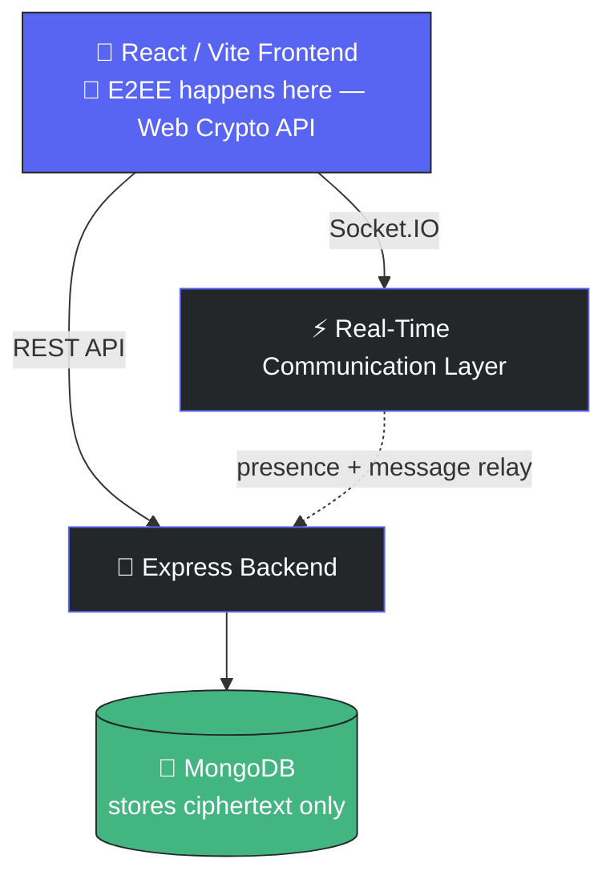

<div align="center">


<br/><br/>


<br/>


<br/><br/>

**A real-time, Discord-inspired chat application** — built with the MERN stack, Socket.IO, and client-side end-to-end encryption.

[✨ Features](#-features) • [🛠️ Tech Stack](#️-tech-stack) • [🔐 Encryption](#-end-to-end-encryption) • [🏗️ Architecture](#️-architecture) • [🚀 Getting Started](#-getting-started)

</div>


## 📖 Overview

> 🟦 **This isn't just another Discord clone tutorial.**
> Most stop at Socket.IO events. This one goes further — messages are encrypted **client-side** with ECDH + AES-GCM before they ever leave the browser, so the server (and anyone who compromises it) never sees plaintext.

<br/>

<div align="center">

</div>

## 🛠️ Tech Stack

<table width="100%">
<tr>
<th width="50%">🎨 Frontend</th>
<th width="50%">⚙️ Backend</th>
</tr>
<tr valign="top">
<td>

**React + Vite**
Fast, component-based UI with instant HMR during development.

**Tailwind CSS**
Utility-first styling used to build the Discord-style responsive interface.

**Redux Toolkit**
Manages global state — authentication, active conversation, online users.

**TanStack Query**
Handles API requests, caching, background refetching, and invalidation.

**Framer Motion**
Powers the UI's micro-interactions — hover states, message pop-ins, sidebar transitions.

</td>
<td>

**Node.js + Express**
REST API and core server-side application logic.

**MongoDB + Mongoose**
Stores users, messages, sessions, backgrounds, and app data.

**Socket.IO**
Real-time messaging and online/offline presence tracking.

**JWT + HTTP-Only Cookies**
Authentication and secure, XSS-resistant session handling.

**ImageKit**
Image hosting and on-the-fly optimization for uploads.

</td>
</tr>
</table>

<br/>

<div align="center">

</div>

## 🔐 End-to-End Encryption

<table width="100%">
<tr>
<td width="33%" align="center">

### 🔑 ECDH
Each client generates a public/private key pair locally — private keys **never** leave the device.

</td>
<td width="33%" align="center">

### 🔒 AES-GCM
Messages are symmetrically encrypted *before* leaving the browser, using an authenticated cipher.

</td>
<td width="33%" align="center">

### 🌐 Web Crypto API
All key generation and encryption uses the browser's native, audited cryptographic APIs.

</td>
</tr>
</table>

### 🔄 How a message travels

```mermaid
sequenceDiagram
    autonumber
    participant A as 👤 User A
    participant S as 🖥️ Server / Socket.IO
    participant B as 👤 User B

    Note over A: Private Key + User B Public Key
    A->>A: Derive ECDH Shared Secret
    A->>A: AES-GCM Encrypt message
    A->>S: Emit encrypted payload
    rect rgb(35, 39, 42)
    Note over S: 🚫 Server never sees plaintext
    end
    S->>B: Forward encrypted payload
    Note over B: Private Key + User A Public Key
    B->>B: Derive same ECDH Shared Secret
    B->>B: AES-GCM Decrypt message
    Note over B: ✅ Original message revealed
```



**In plain terms:** the server is just a courier. It relays encrypted bytes it cannot read, because the AES key is derived independently on each side from a Diffie-Hellman exchange — it's never transmitted anywhere.

<br/>

<div align="center">

</div>

## ⚡ Real-Time Communication

<table width="100%">
<tr>
<td width="33%" align="center">

**🟢 Online Presence**
Tracks connected users and broadcasts live status to their contacts, Discord-style.

</td>
<td width="33%" align="center">

**💬 Instant Messaging**
Messages are pushed over Socket.IO the moment they're sent — no polling.

</td>
<td width="33%" align="center">

**🔄 Multi-Connection Handling**
A single user can stay online across multiple tabs/devices simultaneously.

</td>
</tr>
</table>

### 💬 What it looks like

<div align="center">

| | |
|---|---|
| **Zaid** &nbsp; <sub>Today at 10:41 AM</sub> | 🟢 |
| hey, check out the new encryption flow 👀 | |
| **Maya** &nbsp; <sub>Today at 10:42 AM</sub> | 🟢 |
| whoa this is actually E2EE?? that's sick 🔥 | |
| **Zaid** &nbsp; <sub>Today at 10:42 AM</sub> &nbsp; <sub>✓ seen</sub> | 🟢 |
| yep — ECDH + AES-GCM, server never sees it | |

</div>

<br/>

<div align="center">

</div>

## ✨ Features

| Feature | Description |
|---|---|
| 👤 **Authentication** | Secure login and logout with HTTP-only cookies |
| 💬 **Direct Messages** | One-to-one real-time conversations |
| 🟢 **Online Status** | Shows which friends are currently online |
| 🔐 **E2EE** | Client-side message encryption via ECDH + AES-GCM |
| ↩️ **Reply** | Reply to a specific message in context |
| ✏️ **Edit** | Edit previously sent messages |
| 🗑️ **Delete** | Delete messages you've sent |
| 👁️ **Seen Status** | Read-receipt tracking |
| 🖼️ **Image Upload** | Profile image support via ImageKit |
| 🎨 **Custom Backgrounds** | Personalize chat and profile backgrounds |
| ⚡ **Real-Time Updates** | Powered end-to-end by Socket.IO |
| 📱 **Responsive UI** | Discord-style layout that adapts to any screen |

<br/>

<div align="center">

</div>

## 🏗️ Architecture



<details>
<summary><b>🔍 Click to see how a request flows end-to-end</b></summary>
<br/>

1. **User types a message** → React captures it in local state.
2. **Client encrypts it** with the shared AES-GCM key derived via ECDH.
3. **Socket.IO emits** the encrypted payload to the server.
4. **Express/Socket.IO server** authenticates the socket via JWT, then relays the payload — it never decrypts it.
5. **MongoDB persists** only the encrypted ciphertext, so a database leak reveals nothing readable.
6. **Recipient's client** receives the payload over their own socket connection and decrypts it locally.

</details>

<br/>

<div align="center">

</div>

## 📸 Screenshots

<div align="center">


<sub>Swap this for a real screenshot or, better, a short screen-recording GIF — a live demo sells "real-time" far better than a still image.</sub>
</div>

<br/>

<div align="center">

</div>

## 🚀 Getting Started

<details open>
<summary><b>1️⃣ Clone the repository</b></summary>

```bash
git clone <your-repository-url>
cd discord-clone
```
</details>

<details open>
<summary><b>2️⃣ Install dependencies</b></summary>

```bash
npm install
```
</details>

<details open>
<summary><b>3️⃣ Configure environment variables</b></summary>

Create a `.env` file in the root directory:

```env
MONGO_URI=your_mongodb_connection_string
JWT_SECRET=your_jwt_secret
IMAGEKIT_PUBLIC_KEY=your_imagekit_public_key
IMAGEKIT_PRIVATE_KEY=your_imagekit_private_key
IMAGEKIT_URL_ENDPOINT=your_imagekit_url_endpoint
```
</details>

<details open>
<summary><b>4️⃣ Start the application</b></summary>

```bash
npm run dev
```
</details>

<br/>

<div align="center">

</div>

## 🧠 What I Learned

Building this project involved working through:

- Full-stack MERN application architecture
- REST API design and development
- Real-time communication with Socket.IO
- Authentication with JWT and HTTP-only cookies
- Global state management with Redux Toolkit
- Server-state caching with TanStack Query
- MongoDB data modelling for chat applications
- Client-side cryptography fundamentals — ECDH key exchange, AES-GCM encryption
- Responsive, Discord-style UI development
- Real-time online presence systems

<br/>

<div align="center">


### 👨‍💻 Developer

**Zaid**
Built as a learning project to understand how a modern real-time communication platform works from frontend to backend.

[](#)
[](#)

<br/>

### ⭐ If you like this project, consider giving it a star!


</div>