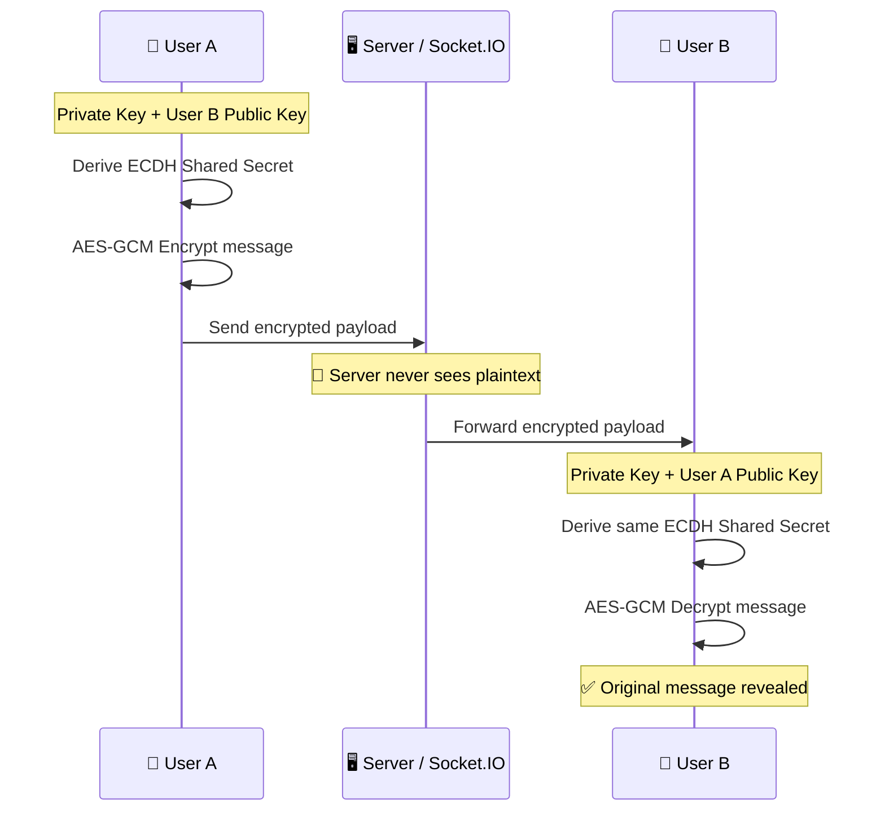

<div align="center">


<br/>


<br/>


**A real-time, Discord-inspired chat application built with the MERN stack, Socket.IO, and client-side end-to-end encryption.**

[Features](#-features) • [Tech Stack](#️-tech-stack) • [Encryption](#-end-to-end-encryption) • [Architecture](#️-architecture) • [Getting Started](#-getting-started)

</div>

<br/>

---

## 📖 Overview

This project is a learning-driven recreation of Discord's core chat experience — real-time messaging, presence tracking, and a modern responsive UI — with one twist: **messages are encrypted client-side** before they ever touch the server, using the same cryptographic primitives (ECDH + AES-GCM) that power production-grade secure messengers.

> 💡 **Why this matters:** most "Discord clone" tutorials stop at Socket.IO events. This one goes further by making sure the server — and anyone who might compromise it — never sees plaintext messages.

<br/>

## 🛠️ Tech Stack

<table width="100%">
<tr>
<th width="50%">🎨 Frontend</th>
<th width="50%">⚙️ Backend</th>
</tr>
<tr valign="top">
<td>

**React + Vite**
Fast, component-based UI with instant HMR during development.

**Tailwind CSS**
Utility-first styling used to build the Discord-style responsive interface.

**Redux Toolkit**
Manages global state — authentication, active conversation, online users.

**TanStack Query**
Handles API requests, caching, background refetching, and invalidation.

**Framer Motion**
Powers the UI's micro-interactions and transitions.

</td>
<td>

**Node.js + Express**
REST API and core server-side application logic.

**MongoDB + Mongoose**
Stores users, messages, sessions, backgrounds, and app data.

**Socket.IO**
Real-time messaging and online/offline presence tracking.

**JWT + HTTP-Only Cookies**
Authentication and secure, XSS-resistant session handling.

**ImageKit**
Image hosting and on-the-fly optimization for uploads.

</td>
</tr>
</table>

<br/>

## 🔐 End-to-End Encryption

<table width="100%">
<tr>
<td width="33%" align="center">

### 🔑 ECDH
Each client generates a public/private key pair locally — private keys never leave the device.

</td>
<td width="33%" align="center">

### 🔒 AES-GCM
Messages are symmetrically encrypted *before* leaving the browser, using an authenticated cipher.

</td>
<td width="33%" align="center">

### 🌐 Web Crypto API
All key generation and encryption uses the browser's native, audited cryptographic APIs — no external crypto libraries.

</td>
</tr>
</table>

### How a message travels



**In plain terms:** the server is just a courier. It relays encrypted bytes it cannot read, because the AES key is derived independently on each side from a Diffie-Hellman exchange — it's never transmitted anywhere.

<br/>

## ⚡ Real-Time Communication

<table width="100%">
<tr>
<td width="33%" align="center">

**🟢 Online Presence**
Tracks connected users and broadcasts live status to their contacts.

</td>
<td width="33%" align="center">

**💬 Instant Messaging**
Messages are pushed over Socket.IO the moment they're sent — no polling.

</td>
<td width="33%" align="center">

**🔄 Multi-Connection Handling**
A single user can stay online across multiple tabs/devices simultaneously.

</td>
</tr>
</table>

<br/>

## ✨ Features

| Feature | Description |
|---|---|
| 👤 **Authentication** | Secure login and logout with HTTP-only cookies |
| 💬 **Direct Messages** | One-to-one real-time conversations |
| 🟢 **Online Status** | Shows which friends are currently online |
| 🔐 **E2EE** | Client-side message encryption via ECDH + AES-GCM |
| ↩️ **Reply** | Reply to a specific message in context |
| ✏️ **Edit** | Edit previously sent messages |
| 🗑️ **Delete** | Delete messages you've sent |
| 👁️ **Seen Status** | Read-receipt tracking |
| 🖼️ **Image Upload** | Profile image support via ImageKit |
| 🎨 **Custom Backgrounds** | Personalize chat and profile backgrounds |
| ⚡ **Real-Time Updates** | Powered end-to-end by Socket.IO |
| 📱 **Responsive UI** | Discord-style layout that adapts to any screen |

<br/>

## 🏗️ Architecture

```
                    ┌──────────────────┐
                    │   React / Vite    │
                    │     Frontend      │
                    │  (🔐 E2EE happens  │
                    │   here — Web      │
                    │   Crypto API)     │
                    └─────────┬─────────┘
                              │
               ┌──────────────┴──────────────┐
               │                              │
          REST API                      Socket.IO
               │                              │
               ▼                              ▼
        ┌─────────────┐              ┌─────────────────┐
        │   Express   │              │   Real-Time      │
        │   Backend   │              │   Communication  │
        └──────┬──────┘              └─────────────────┘
               │
               ▼
        ┌─────────────┐
        │   MongoDB   │
        │   Database  │
        │ (stores only│
        │  ciphertext)│
        └─────────────┘
```

<details>
<summary><b>🔍 Click to see how a request flows end-to-end</b></summary>
<br/>

1. **User types a message** → React captures it in local state.
2. **Client encrypts it** with the shared AES-GCM key derived via ECDH.
3. **Socket.IO emits** the encrypted payload to the server.
4. **Express/Socket.IO server** authenticates the socket via JWT, then relays the payload — it never decrypts it.
5. **MongoDB persists** only the encrypted ciphertext, so a database leak reveals nothing readable.
6. **Recipient's client** receives the payload over their own socket connection and decrypts it locally.

</details>

<br/>

## 📸 Screenshots

<div align="center">


<sub>Replace this with an actual screenshot or a GIF of the app in action — animated demos convert much better than static images.</sub>
</div>

<br/>

## 🚀 Getting Started

<details open>
<summary><b>1️⃣ Clone the repository</b></summary>

```bash
git clone <your-repository-url>
cd discord-clone
```
</details>

<details open>
<summary><b>2️⃣ Install dependencies</b></summary>

```bash
npm install
```
</details>

<details open>
<summary><b>3️⃣ Configure environment variables</b></summary>

Create a `.env` file in the root directory and add your configuration:

```env
MONGO_URI=your_mongodb_connection_string
JWT_SECRET=your_jwt_secret
IMAGEKIT_PUBLIC_KEY=your_imagekit_public_key
IMAGEKIT_PRIVATE_KEY=your_imagekit_private_key
IMAGEKIT_URL_ENDPOINT=your_imagekit_url_endpoint
```
</details>

<details open>
<summary><b>4️⃣ Start the application</b></summary>

```bash
npm run dev
```
</details>

<br/>

## 🧠 What I Learned

Building this project involved working through:

- Full-stack MERN application architecture
- REST API design and development
- Real-time communication with Socket.IO
- Authentication with JWT and HTTP-only cookies
- Global state management with Redux Toolkit
- Server-state caching with TanStack Query
- MongoDB data modelling for chat applications
- Client-side cryptography fundamentals
- ECDH key exchange
- AES-GCM authenticated encryption
- Responsive, Discord-style UI development
- Real-time online presence systems

<br/>

## 📦 Built With

<div align="center">

| | | | |
|:---:|:---:|:---:|:---:|
| ⚛️ **React** | ⚡ **Vite** | 🟢 **Node.js** | 🚂 **Express** |
| 🍃 **MongoDB** | 🔌 **Socket.IO** | 🔄 **Redux Toolkit** | 📡 **TanStack Query** |
| 🎨 **Tailwind CSS** | ✨ **Framer Motion** | 🖼️ **ImageKit** | 🔐 **Web Crypto API** |

</div>

<br/>

## 👨‍💻 Developer

<div align="center">

**Zaid**

Built as a learning project to understand how a modern real-time communication platform works from frontend to backend.

[](#)
[](#)

</div>

<br/>

---

<div align="center">

### ⭐ If you like this project, consider giving it a star!


</div>